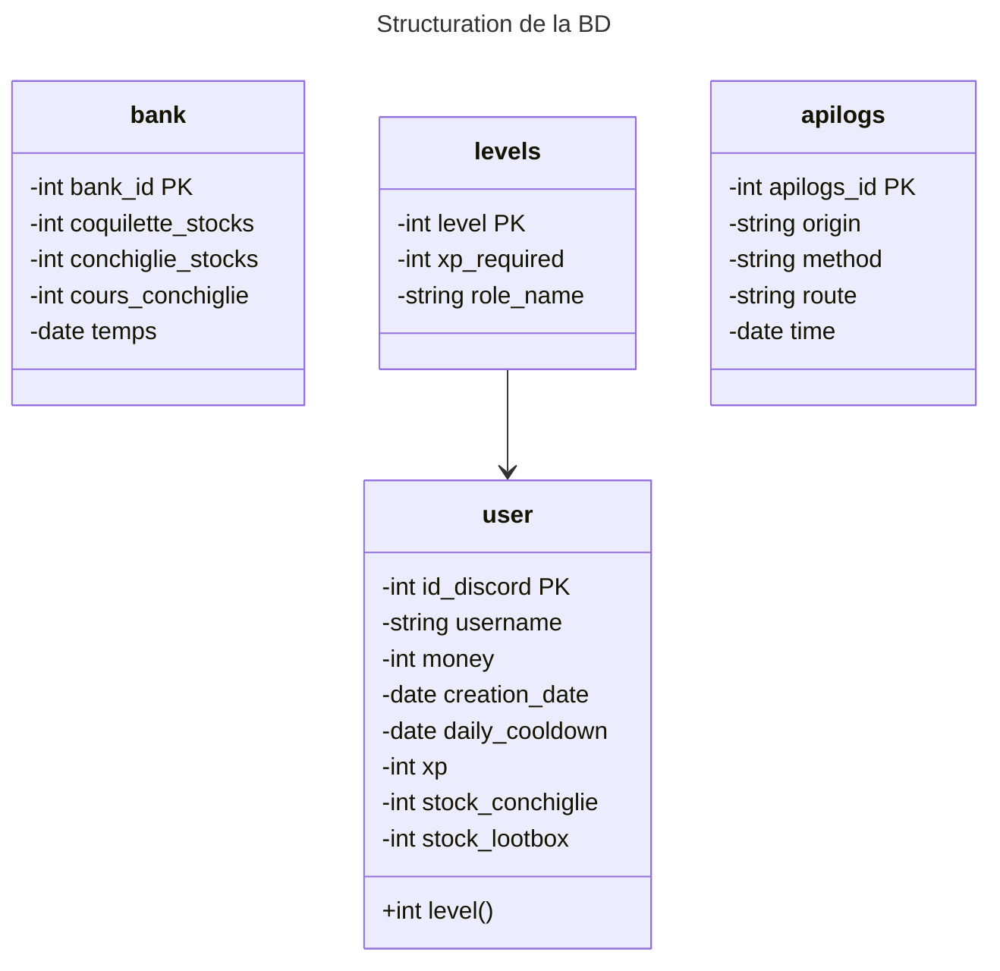
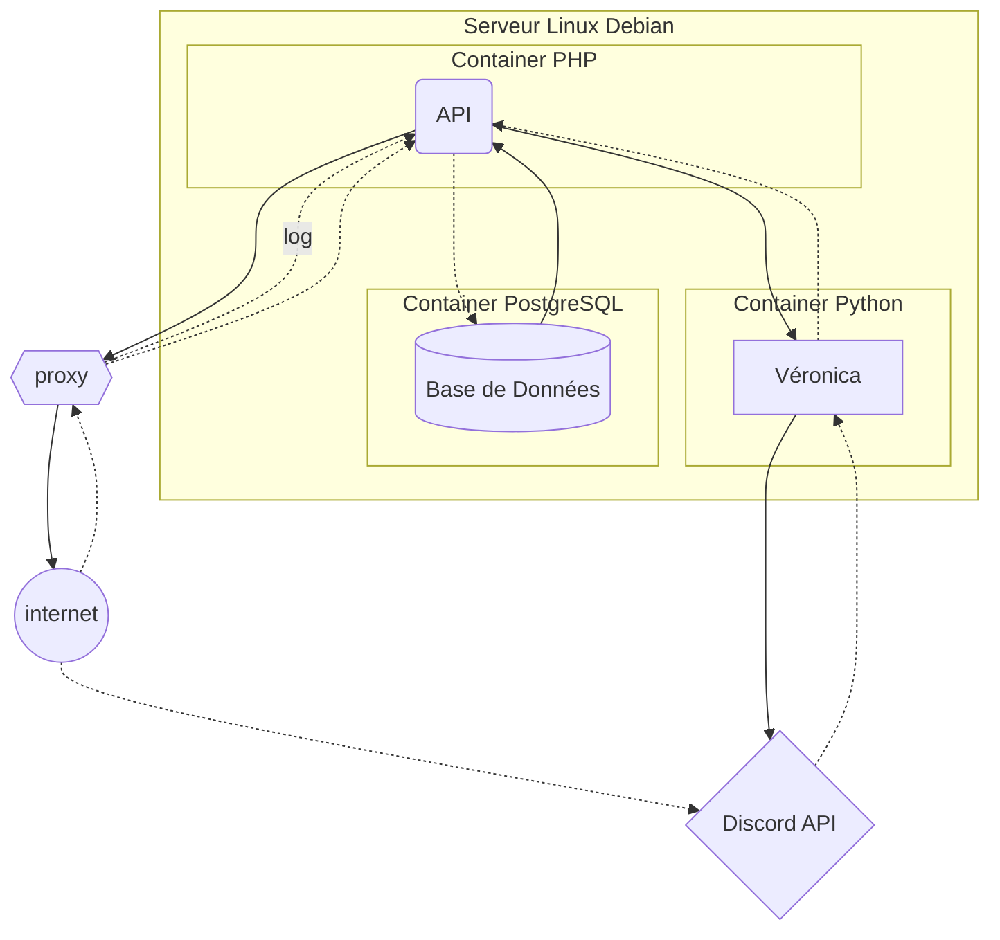

# Veronica API
API dédié pour les actions qui seront executées sur le système de Véronica. L'idée est que le système permettant de connecter le site web ainsi que Véronica soient les mêmes.
- [Structure de la base de données](#struture-de-la-bd)
- [Structuration du serveur](#structure-réseau-du-serveur)

## Description des dossiers
> `/veronica-api`

Ce dossier contient tout le code de l'API

> `/process`

Ce dossier documente les actions qui ont été réalisées pour la mise en place de certaines choses au travers de ce projet. Il sert simplement d'index pour les développeurs.
## Struture de la BD
Voici une sorte de MCD/MLD mais en markdown de la structure de la base de données qui sera utilisée par **Véronica**.

A noter qu'un diagramme de classe mermaid est utilisé pour plus facilement se visualier la structure BD, donc les fonctions ne sont pas des fonctions mais plutôt des **clés étrangères**. Les fléches signifient que leur clé primaire est utilisée en tant que clé étrangère dans une autre table. Les flèches vides ont comme restriction `ON DELETE CASCADE`

### Description des tables
Voici la description et les détails de chacunes des tables
#### user
Représente un utilisateur, identifié par son identifiant Discord (`id_discord`).
- `name` : pseudo de l'utilisateur sur le serveur BDN
    - A chaque appel de l'API concernant un utilisateur, une fonction se déclenchera pour vérifier si l'utilisateur n'a pas changé de pseudo
    - Une liste d'utilisateurs sera trié par ordre alphabétique du pseudo
- `money` : Quantité d'argent qu'à en stock un utilisateur
- `creation_date` : Date de création du compte de l'utilisateur dans la base de données de Véronica
- `daily_cooldown` : Date du dernier `/daily` qu'a réalisé l'utilisateur. Permet de calculer depuis combien de temps il n'a pas fait de commande `/daily`
- `xp` : quantité d'xp accumulée par l'utilisateur
    - 0 est la valeur par défaut et minimum
- `level` : représente le niveau actuel du joueur. C'est une clé étrangère, afin de pouvoir facilement obtenir son nom
- `stock_conchiglie` : Nombre de conchiglie qu'a un utilisateur
- `stock_lootbox` : Nombre de lootbox qu'a un utilisateur
#### bank
Représente la banque du système. Chaque ligne est une trace écrite du cours des stocks de la banque en fonction de la date.
- `bank_id` : histoire d'avoir une clé primaire, ça peut toujours être utile
- `coquilette_stocks` : représente le nombre de coquilettes encore en stock
- `conchiglie_stocks` : représente le nombre de conchiglie encore libre d'achat
- `temps` : c'est simplement un chant où la ligne a été écrite
#### apilogs
Journeaux des requêtes qui ont été faites à l'API.
- `apilogs_id` : histoire d'avoir une clé primaire, ça peut toujours être utile
- `origin`: précise l'origine de la requête
    - `web` si ça provient du site qui est basé sur cette API
    - `veronica` si c'est une requête faite par Véronica
    - Autrement ce sera directement l'ip de la requête. Il faudrait faire en sorte que les ip ne soient pas directement retournées par un get
- `method` : Méthode HTTP utilisée pour l'action
- `route` : Ressource demandée par la requête
- `time` : Quand est ce que cette requête a été faite
> La génération d'une ligne de cette table doit seulement se faire par le proxy. Si ce n'est pas possible d'intercepter les requêtes du bot, il faudrait que dès que le bot fasse une requête une ligne soit aussi générée
## Structure réseau du serveur
L'idée est qu'un serveur sera déployé pour à la fois host le bot, mais aussi l'API. Un début d'implémentation a été envisagé, mais au final on va probablement opter pour quelque chose du style :

A noter que :
- Les containers seront des containers Docker
- Quand une requête est effectuée au proxy, le proxy demande à l'API la création d'un log dans la base de données