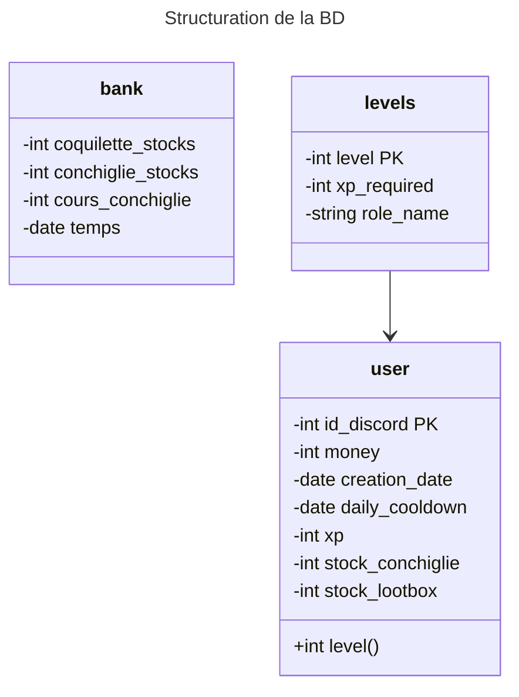

# Veronica API
API dédié pour les actions qui seront executées sur le système de Véronica. L'idée est que le système permettant de connecter le site web ainsi que Véronica soient les mêmes.

## Description des dossiers
> `/veronica-api`

Ce dossier contient tout le code de l'API

> `/process`

Ce dossier documente les actions qui ont été réalisées pour la mise en place de certaines choses au travers de ce projet. Il sert simplement d'index pour les développeurs.
## Struture de la BD
Voici une sorte de MCD/MLD mais en markdown de la structure de la base de données qui sera utilisée par **Véronica**.

A noter qu'un diagramme de classe mermaid est utilisé pour plus facilement se visualier la structure BD, donc les fonctions ne sont pas des fonctions mais plutôt des **clés étrangères**. Les fléches signifient que leur clé primaire est utilisée en tant que clé étrangère dans une autre table. Les flèches vides ont comme restriction `ON DELETE CASCADE`
